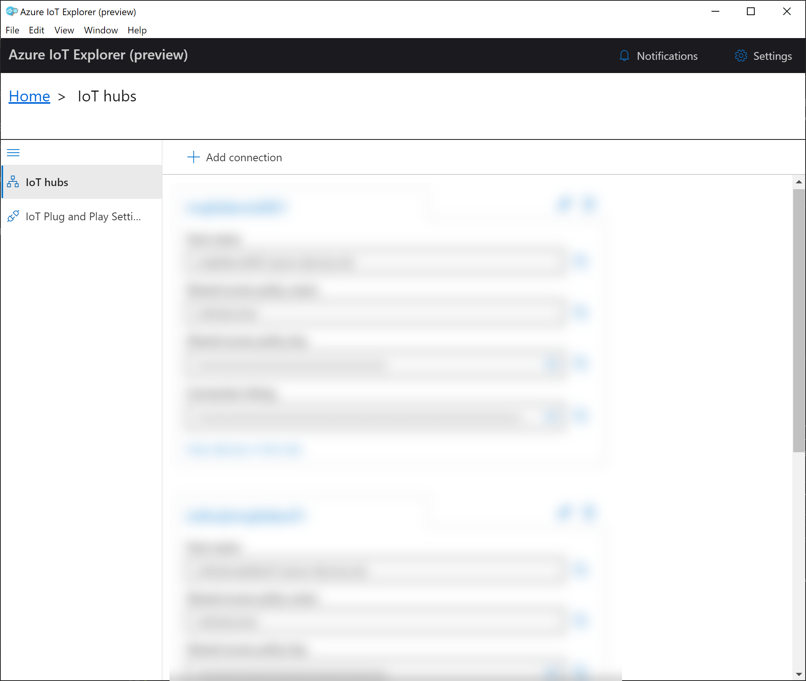

# Getting Started

A shared Azure Subscription has been setup for attendees. This section describes the steps to access the environment as well as setting up your laptop for the steps that follow.

## Learning Goals
* Access Azure Portal
* Download tools


## Steps
* [Clone Repo](#clone-repo)
* [Access Azure Portal](#access-azure-portal)
* [Download Tools](#download-tools)
* [Install Azure IoT Explorer](#azure-iot-explorer)
* [Download Device Simulator](#download-device-simulator)
* [Install VS Code and IoT Extensions](#install-vs-code-and-iot-extensions)

### Clone Repo
This repository includes a working folder "labs" that is assumed to be the current folder for executing tools and scripts from the command line. 
1. Clone this repository to a folder on your development machine
   ```
   git clone https://github.com/rivms/workshop-edge-to-cloud.git
   cd workshop-edge-to-cloud
   cd labs
   ```
1. Change directory to the "labs" folder

### Access Azure Portal
1. Visit the [Azure Portal](https://portal.azure.com)
1. Sign-in using your assigned credentials
1. You will have access to two resource groups
   - labXX-dev-rg - Resource group for each user with resources to be configured during the lab
   - shared-dev-rg - Shared resource group with resources such as a storage account containing files and other resources for download

### Azure IoT Explorer
Follow the instructions availabe [here](https://docs.microsoft.com/en-us/azure/iot-pnp/howto-use-iot-explorer) to download and install. When running the tool the inital screen will appear similar to the following screenshot. 


### Download Device Simulator
Executables for Linux, Windows and OSX have been uploaded to a shared storage account.
1. Via the Azure Portal navigate to the "shared-dev-rg" resource group
1. In the "shared-dev-rg" pane click the storage account **workshopsharedst001**
1. In the "workshopsharedst001" pane click the **Containers** tile
1. In the "Containers" pane click the **resources** container
1. Navigate to the simulator pane and download the executable for your environment

### Install VS Code and IoT Extensions
Once installed add the Azure IoT extensions
1. Download and install [VS Code](https://code.visualstudio.com/download)
2. Run VS Code and install the [Azure IoT Tools](https://marketplace.visualstudio.com/items?itemName=vsciot-vscode.azure-iot-tools) extension