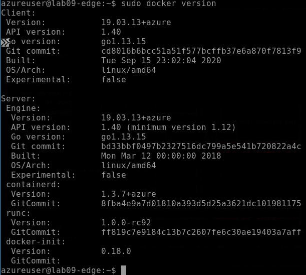
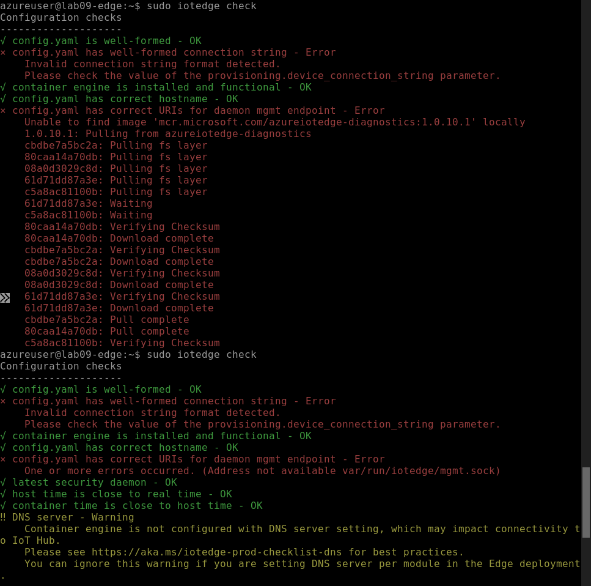
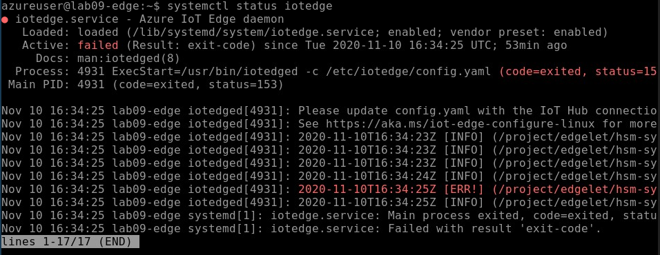
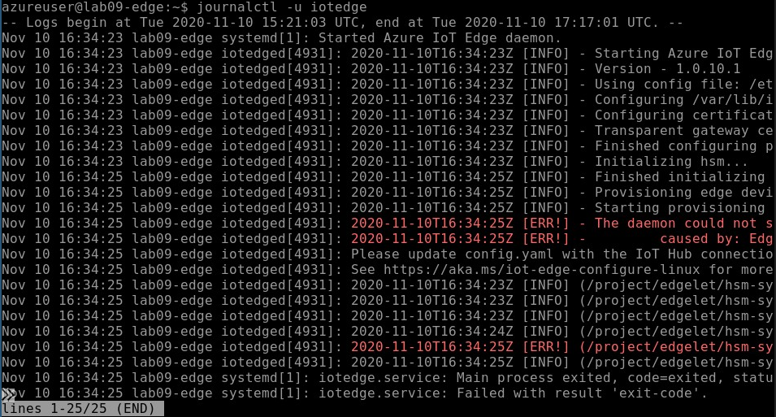

# Azure IoT Edge Device Software Installation
An Ubuntu 18.04 vm has been provisioned in each resource group. The installation steps will be run on this machine via ssh.  

## Learning Goals
* Edge device remote access via ssh  
* Install moby engine
* Install IoT Edge runtime components
* Installed software check

## Resources
* [IoT Edge runtime architecture](https://docs.microsoft.com/en-us/azure/iot-edge/iot-edge-runtime)
* [Security manager architecture](https://docs.microsoft.com/en-us/azure/iot-edge/iot-edge-security-manager)
* [IoT Edge OSS project](https://github.com/Azure/iotedge)

## Steps
* [Connect to VM via SSH](#connect-to-vm-via-ssh)
* [Configure apt repository](#repository-configuration)
* [Install a container engine](#install-moby)
* [Install IoT Edge security manager](#install-iot-edge-security-manager)
* [Check installation](#check-installation)


### Connect to VM via SSH
The ssh key needed to authenticate is provided in the shared storage account **workshopsharedst001** in the **shared-dev-rg** resource group
1. Navigate to the **ssh** folder
1. Download the key in the format appropriate for your ssh terminal client such as PuTTY 
1. Save the downloaded files to the "labs\ssh" folder
1. The connection URL can be found via the Azure Portal
1. Navigate to the virtual machine over view. Visit the resource group and then click on the virtual machine name such as "latencyedgedevlab01"
1. On the virtual machine pane click the **Connect** button at the top of the page
1. Now click **SSH**, the ssh connection details are show in bullet point 4 such as
   ```
   ssh -i <private key path> azureuser@<vm name>.southeastasia.cloudapp.azure.com
   ```
1. Use the details above and download private key to connect to the virtual machine. If you experience an issue with the permissions assigned to the private key file the following [question/answer](https://superuser.com/questions/1296024/windows-ssh-permissions-for-private-key-are-too-open) may assist.  


### Repository Configuration
The VM needs additional configuration before the edge runtime can be install. Run the steps below via the SSH session
1. Follow the steps on this documentation page for installing the [pre-requisites for Ubuntu 18.04](https://docs.microsoft.com/en-us/azure/iot-edge/how-to-install-iot-edge?tabs=linux#prerequisites)

### Install Moby
The [Moby](https://mobyproject.org/) engine is the  officially supported container engine for Azure IoT Edge
1. [Moby runtime installation steps](https://docs.microsoft.com/en-us/azure/iot-edge/how-to-install-iot-edge?tabs=linux#install-a-container-engine) 

### Install IoT Edge Security Manager
The security manager is comprised of three key components whose primary responsibility from an installation perspective is boostrapping the IoT Edge runtime components
1. [Installtion steps](https://docs.microsoft.com/en-us/azure/iot-edge/how-to-install-iot-edge?tabs=linux#install-the-iot-edge-security-daemon)

### Check Installation
At this stage the IoT Edge runtime has been installed but not configured. Errors in the logs are expected so the steps below validate only that the required components are now available for use.
1. Moby installation check
   ```
   sudo docker version
   ```
   
1. IoT edge runtime configuration check. A cli tool, iotedge, is provided to assist with querying and validating the state of the install edge runtime. Configuration errors are expected to be reported
   ```
   sudo iotedge check
   ```
   
1. Security daemon status check. The security daemon is currently in a failed state as it's configuration file has not been populated as yet.
   ```
   systemctl status iotedge
   ```
   
1. Security daemon logs. The logs again show that the configuration file, config.yaml, has not been updated.
   ```
   journalctl -u iotedge
   ```
   