# Azure IoT Edge Configuration
Azure IoT Edge enables a hybrid architecture by providing a secure, container based solution deployed at edge locations and integrating with a cloud based gateway, IoT Hub, that provides edge and leaf device management, bidrectional communication and edge compute orchestration. To get started the initial installation of the Azure IoT Edge runtime software includes a sample configuration file "/etc/iotedge/config.yaml". The default values provided by the installer are sufficient to get started with minimumal additional configuration. The bootstrap or provisioning process relies on connecting with the IoT Hub instance that will manage the edge device. 

To complete this configuration goal two approaches are available:
- Supplying connection details for the IoT Hub
- Just in time provisioning via the [Azure IoT Hub Device Provisioning Service](https://docs.microsoft.com/en-us/azure/iot-dps/) 

A just in time provisioning process offers a scalable approach for the configuration of multiple edge devices which is the approach used in this section. 

## Learning Goals
* Edge device configuration  
* Just in time provisioning
* Edge device attestation
* Edge device configuration check

## Resources
* [Symmetric key attestation](https://docs.microsoft.com/en-us/azure/iot-dps/concepts-symmetric-key-attestation?view=iotedge-2018-06)
* [Deriving device keys for a group enrollment](https://docs.microsoft.com/en-us/azure/iot-dps/how-to-use-custom-allocation-policies#derive-unique-device-keys)
* [Using custom allocation policies](https://docs.microsoft.com/en-us/azure/iot-dps/tutorial-custom-allocation-policies?view=iotedge-2018-06&tabs=powershell)

## Steps
* [Review configuration file](#review-configuration)
* [Deriving Symmetric Key for an Edge Device](#deriving-symmetric-key)
* [Install IoT Edge security manager](#install-iot-edge-security-manager)
* [Check installation](#check-installation)
### Repository Configuration
Perform the steps for your linux distribution
1. [Ubuntu 18.04](https://docs.microsoft.com/en-us/azure/iot-edge/how-to-install-iot-edge?tabs=linux#prerequisites)

### Review Cofiguration
The inital configuration file is located at "/etc/iotedge/config.yaml". 
1. Connect to the virtual machine via ssh. The details for connecting to the virtual machine can be found via the portal. 

1. The ssh key can be downloaded from the resource url shared at the session
1. Once connected mount the shared folder by running the command below. The shared files will be used later in this section 
   ```
   sudo mount -a
   ``` 

1. The IoT Edge config file can now be viewed using the command below. No changes are needed just yet, browse the file and familiarise yourself with its structure
   ```
   sudo nano /etc/iotedge/config.yaml
   ``` 
   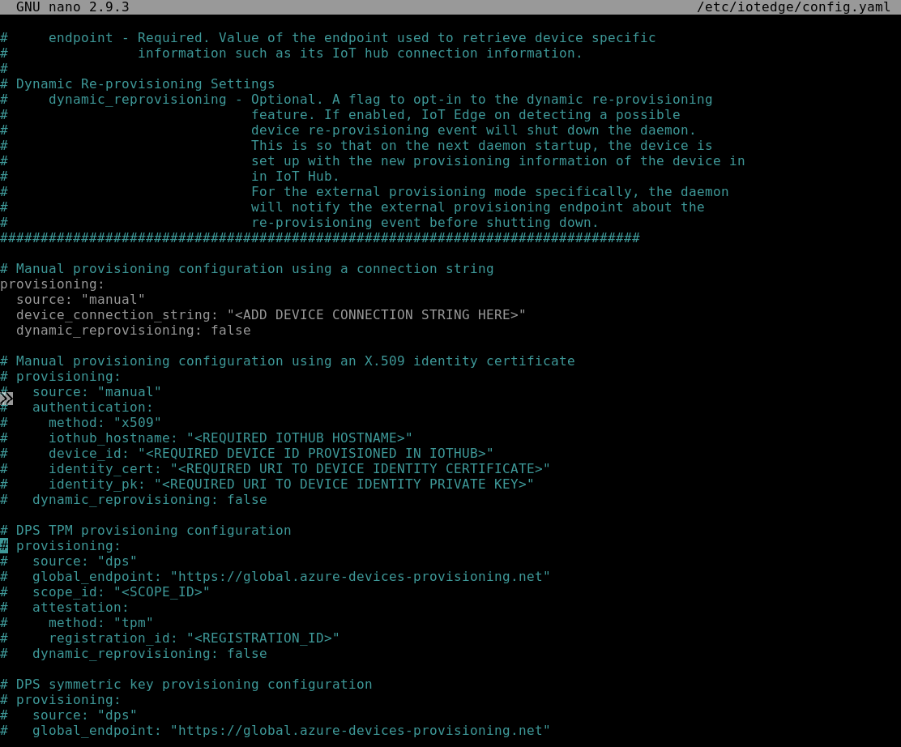


### Deriving Symmetric Key


The Azure DPS symmetric key provisioning method will be used. This requires three pieces of information:
- A scope id
- A registration id
- A symmetric key derived using the registration id and the group enrollment key


Once configured the IoT Edge security daemon will on startup connect to the Azure Device Provisioning Service and be assigned an IoT Hub instance to connect to. This allows at scale provisioning which in this scenario leverages an Azure Function that determines the IoT Hub instance to use. The logic to determine the IoT Hub instance simply examines the edge vms name and uses the numbered suffix to select an IoT Hub instance with a similar suffix.

1. The scope id will be provided in the session
1. The registration id is the edge device identifier that will be seen in IoT Hub. It is recommended that the vm name be used as the registration id
1.  The symmetric key needs to be derived using the registration id and group enrollment key (also provided in the session)
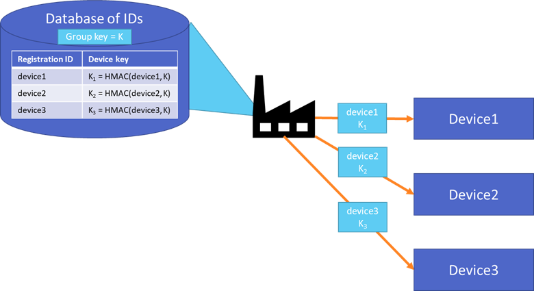
1. Run the steps below to derive a device key for the edge device, this string will need to be filled into the config file viewed in a previous step. This derivation process ensures that the group key is not present on the edge device.
  ```
  DPSGROUPKEY="<paste provided key>"
  REGISTRATION_ID=$(hostname)
  keybytes=$(echo $DPSGROUPKEY | base64 --decode | xxd -p -u -c 1000)
  echo -n $REGISTRATION_ID | openssl sha256 -mac HMAC -macopt hexkey:$keybytes -binary | base64
  ```
  
1. Copy and paste the derived key value to a temporary location for use in a later step in this section

### Update config file
The config file "/etc/iotedge/config.yaml" will now be updated to use the Azure IoT Hub Device Provisioning to boostrap its configuration and connection to an IoT Hub instance.
1. The following values are needed
   - Scope Id for the Azure IoT Hub Device Provisioning Service. This will be provided at the session
   - Registration Id. This is the value used in deriving the device key. It was selected to be the edge devices host name. Retrieve the value by running the below command in the ssh session
   ```
   hostname
   ```
   - Derived symmetric key. This is the value saved in the previous step  
   - Fully qualified domain of the vm. On the **Overview** pane for the vm (Azure Portal), in the upper section, locate the **DNS name** field. It will be of the form:  
   ```
   <vm name>.southeastasia.cloudapp.azure.com
   ```
1. Open the config file in a text editor
   ```
   sudo nano /etc/iotedge/config.yaml
   ```
1. Locate the manual provisioning using a connection string section in the config file
   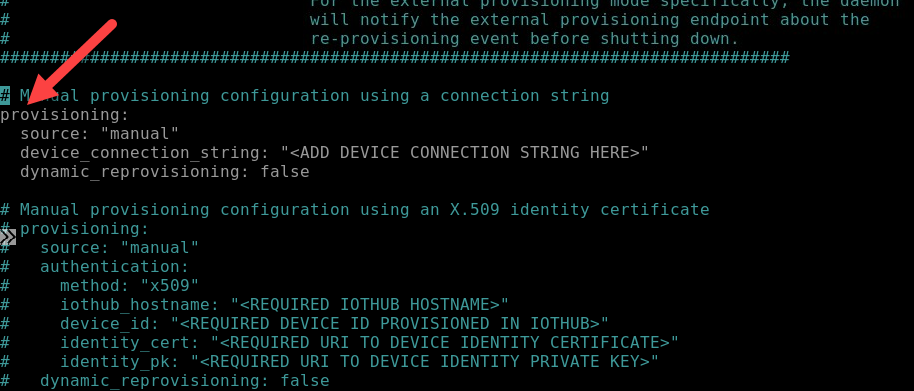
1. Comment out the manual provisioning fields as we will be using the Azure IoT Hub Device Provisioning Service configuration section
   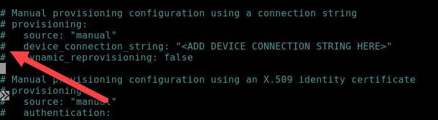
1. Locate the DPS symmetric key provisioning configuration sectinon in the config file
   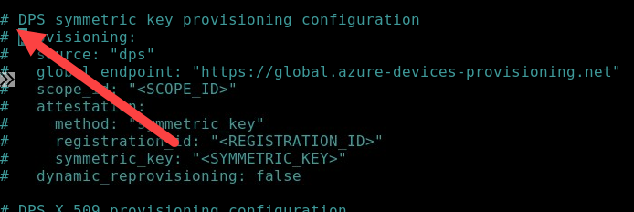
1. Uncomment the DPS symmetric key provisioning configuration section and fill in values for the following fields:
   - scope_id - provided in the session
   - registration_id - edge device host name
   - symmetric_key - derived symmetric key from earlier step
   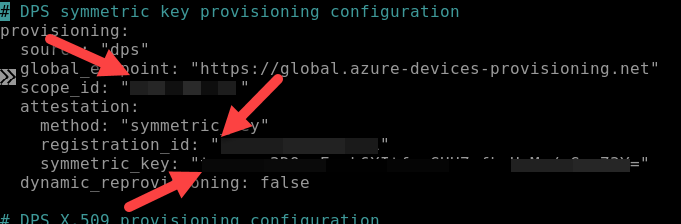
1. Update the **hostname** field. Scroll until the **Edge device hostname** section. The value is set, by default, to hostname for the vm. 
   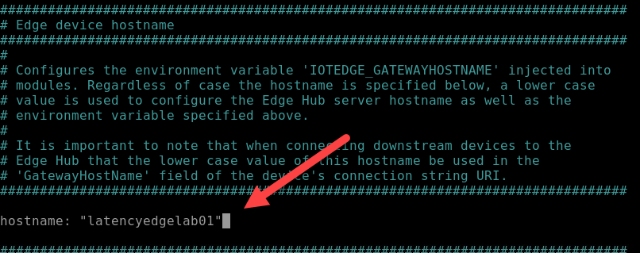
1. Replace the current value with fully qualified domain name of the vm.
   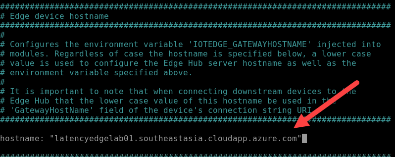
1. Save the changes and exit the text editor

### Edge Device Provisioning
The provisioning process will begin once the IoT Edge service is restarted. The IoT Edge security daemon functions as a client of the Azure IoT Hub Device Provisioning service and will connect to the assigned IoT Hub instance and start the initial IoT Edge modules
1. Restart the IoT Edge service
   ```
   sudo systemctl restart iotedge
   ```
2. Inspect the logs for any errors
   ```
   journalctl -u iotedge
   ```
3. Inspect the status of the IoT Edge service
   ```
   systemctl status iotedge
   ```
1. Check the configuration. Some errors will be reported, these are expected as this isn't a production setup but importantly all Connectivity checks should succeed. This is a useful tool to assist with troubleshooting configuration errors in the future. 
   ```
   sudo iotedge check
   ``` 
   
1. Successful provisioning will result in a new IoT Edge device being registered with the appropriate IoT Hub instance. This IoT Hub instance will be in the same resource group as the IoT Edge device vm
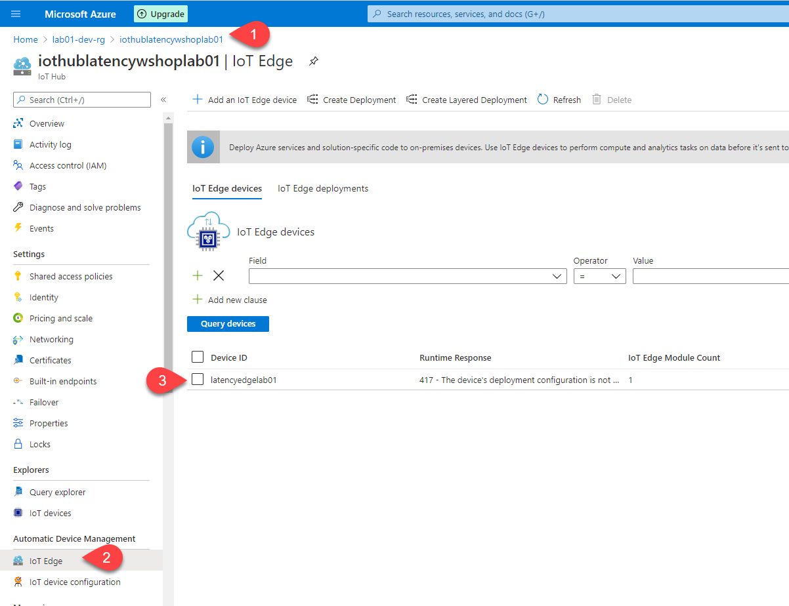


### Configure edgeHub Module
At this stage the edge device has been provisioned with connectivity to IoT Hub but only a single system module "edgeAgent" which deploys and monitors modules on the device is deployed. Any attempts to connect a leaf device to the edge device will fail, the edgeHub module is responsible for leaf device connectivity. 
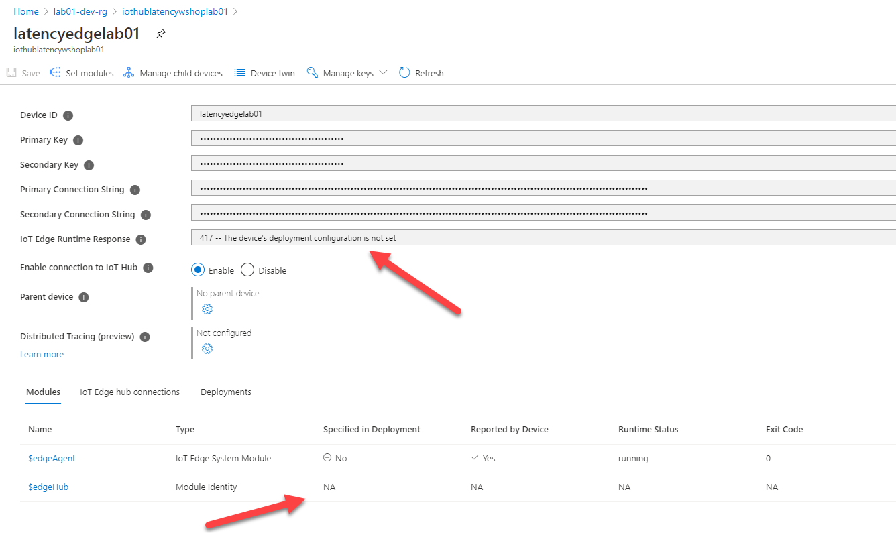
1. Verify lack of connectivity by running the following from your development machine, replacing the fully qualified domain name for your IoT Edge Device
   ```
   openssl_client -connect <fqdn>:8883
   ```
2. An error message is expected
   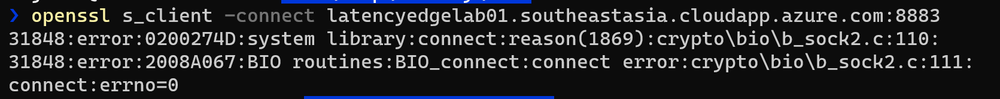
1. Navigate to the **Overview** page for the IoT Hub instance, on the left-side menu under **Automatic Device Management**, click **IoT Edge**
1. On the **IoT Edge** pane click the edge device name to manage the device
1. At the top of the pane click **Set Modules**. Click **Next: Routex>** button then **Next: Review + create** and finally the **Create** button
   - The default values are used at each stage of the wizard as the goal is to have the edgeHub module deployed. Reviewing the **Deployment** json on the final page of the wizard we can see the **edgeHub** module being deployed and its twin configured
      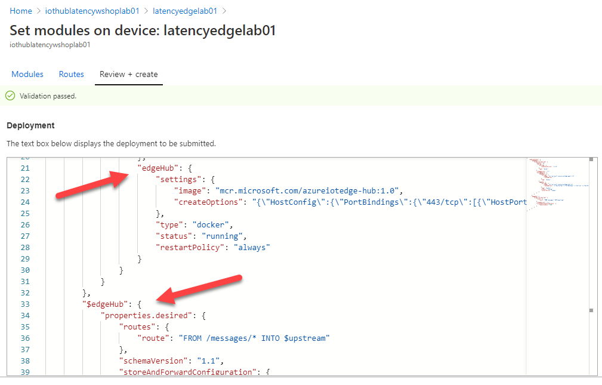
1. After a minute we will see that the edgeHub module has been deployed. From the ssh session to the IoT edge vm run:
   ```sudo iotedge list```
   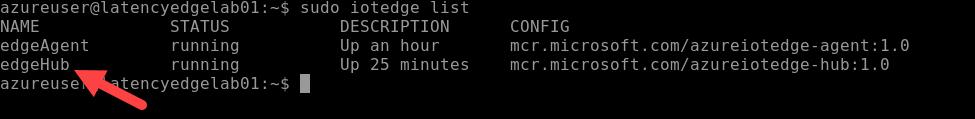
1. From your development machine re-run the connectivity test
   ```
   openssl_client -connect <fqdn>:8883
   ```
   A connection will be established but take note of the final lines of output, the certificate chain cannot be verified
   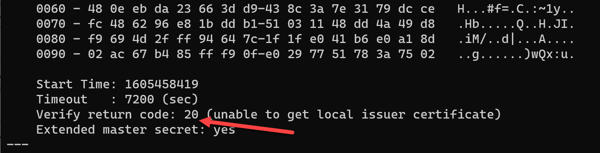

### Configure IoT Edge Device CA Certificates
As noticed in the previous section a client application isn't able to connect successfully to the edgeHub as the root certificate isn't trusted. The edgeHub uses a server TLS certificate generated and signed by the IoT Edge security daemon. More details can be found in the following documentation pages:
   - [Understand how Azure IoT Edge uses certificates](https://docs.microsoft.com/en-us/azure/iot-edge/iot-edge-certs?view=iotedge-2018-06)
   - [Manage certificates on an IoT Edge device](https://docs.microsoft.com/en-us/azure/iot-edge/how-to-manage-device-certificates?view=iotedge-2018-06)
   - [Create demo certificates to test IoT Edge device features](https://docs.microsoft.com/en-us/azure/iot-edge/how-to-create-test-certificates?view=iotedge-2018-06)

In the interest of time test certificates have been pre-created viz., a root ca certificate and a device ca certificate chain. Consult the article on creating [demo certificates](https://docs.microsoft.com/en-us/azure/iot-edge/how-to-create-test-certificates?view=iotedge-2018-06) if you would prefer to generate a set of certificates yourslef.  
   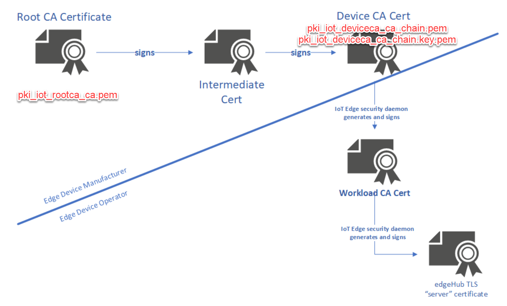
1. Once generated the following certificates and keys need to be copied to the IoT Edge vm:
   - Device CA certificate. If using intermediate certificates this should represent the entire certificate chain. In the case of the diagram above this would be the Root CA Certificate, Intermediate CA certificate and Device CA certificate
   - Device CA private key. Private key corresponding to the device ca certificate
   - Root CA certificate. This is the certificate at the root of the certificate chain
1. Stop the IoT Edge runtime by running the following command via the ssh terminal for the IoT Edge vm
   ```sudo systemctl stop iotedge```
1. Confirm that the runtime has stopped via the ssh terminal by running the command below. Press 'q' to return to the command line
   ```
   systemctl status iotedge
   ```
1. The necessary certificates need to be copied to the VM. This can be done in a number of ways such as via scp. If you choose to use the supplied certificates they can be found mounted as a file share at ```/mnt/workshop/edge_certs/```
   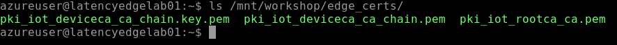
1. The commands that follow copy the certficates to the IoT Edge vm and configure appropriate file system permissions and ownership
   ```
   sudo mkdir /etc/iotedge/certs && sudo chown iotedge:iotedge /etc/iotedge/certs
   sudo rsync -og --chown=iotedge:iotedge /mnt/workshop/edge_certs/*.pem /etc/iotedge/certs/
   ls /etc/iotedge/certs
   ```
1. With the files copied the **config.yaml** file must be updated to use the new certificates. Edit the file as was done previously ```sudo nano /etc/iotedge/config.yaml```
1. Locate the currently commented out **Certificate settings** section
   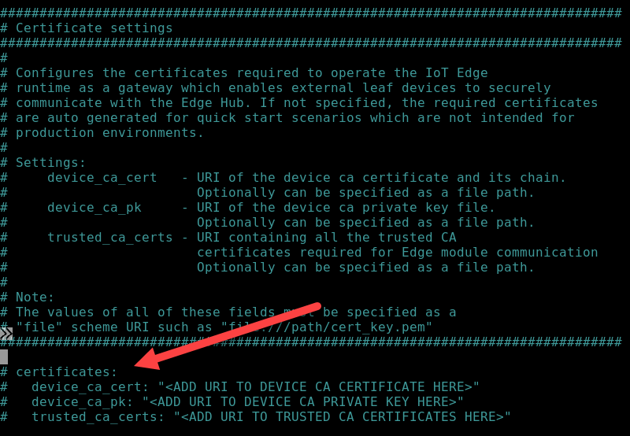
1. Uncomment the certificate files and if using the provided certificates update the configuration file as follows:
   - device_ca_cert: "/etc/iotedge/certs/pki_iot_deviceca_ca_chain.pem"
   - device_ca_pk: "/etc/iotedge/certs/pki_iot_deviceca_ca_chain.key.pem"
   - trusted_ca_certs: "/etc/iotedge/certs/pki_iot_rootca_ca.pem"
   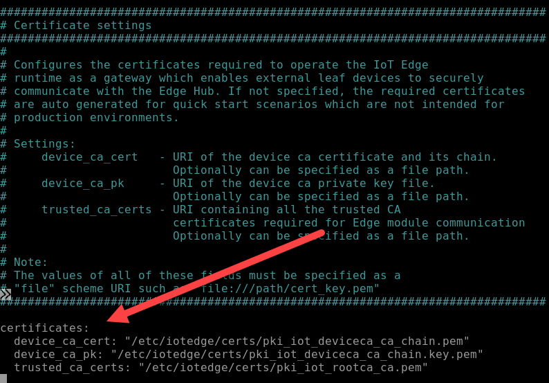
1. The IoT Edge daemon can be restarted which will result in the boostrapping of the system and application modules
   ```
   sudo systemctl restart iotedge
   ```
1. Check the status of the IoT Edge security daemon
   ```
   systemctl status iotedge
   ```
   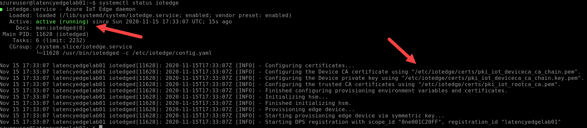
1. Check the iotedge configuration, checks (and errors) should be as before. Ensure that certificates are still reported as ok
   ```
   sudo iotedge check
   ```
1. From your development machine re-run the connectivity test
   ```
   openssl_client -connect <fqdn>:8883
   ```
   A connection will be established but take note of the final lines of output, the certificate chain cannot be verified but the certificate chain now reflects the newly configured certificates. 
   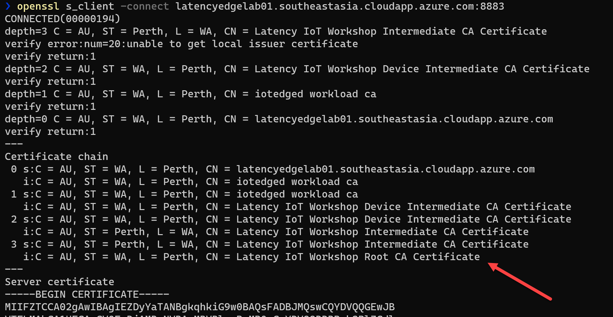
1. Download a copy of the root certificate to you development machine. A link will be provided in the session. The connectivity test from your development machine can be re-run with the root certificate specified. The expected output is a return code of 0.
   ```
   openssl s_client -connect latencyedgelab01.southeastasia.cloudapp.azure.com:8883 -CAfile .\pki_iot_rootca_ca.pem
   ```
   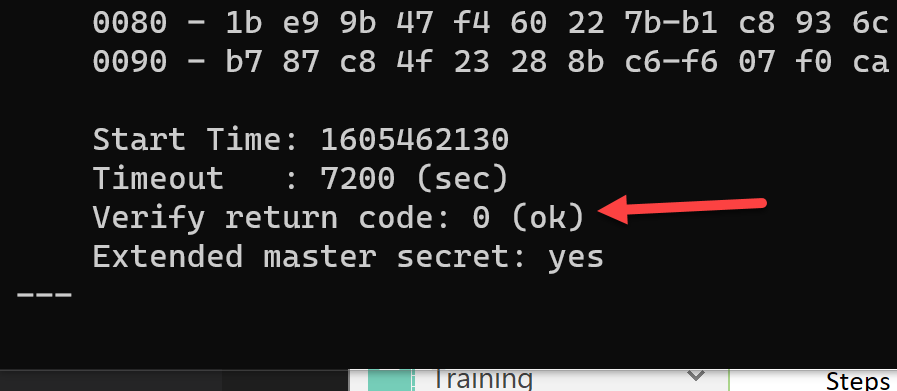

