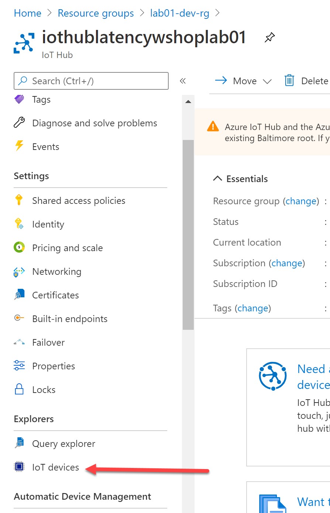
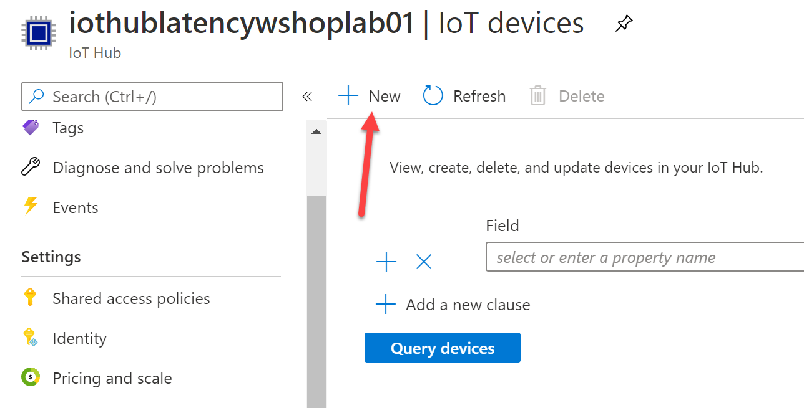
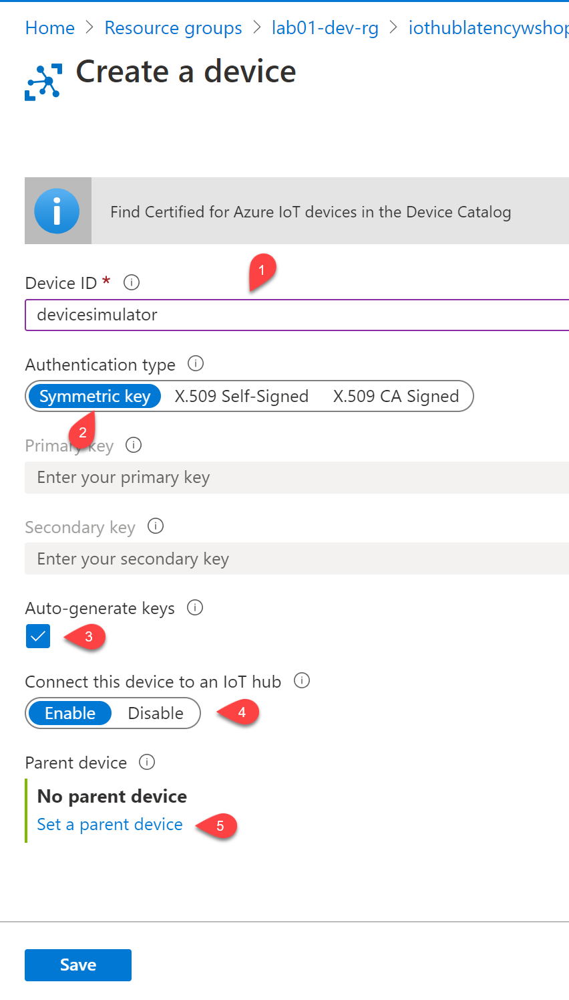
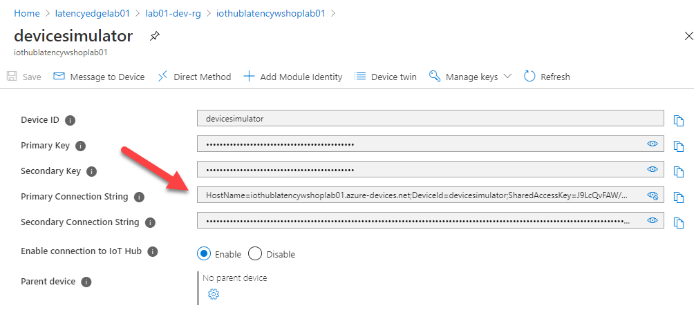
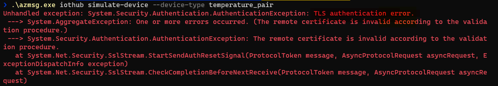

# Telemetry at the Edge
Now that the edge device has been provisioned we focus on enabling the communication of telemetry from leaf devices, which connect to the edge device directly, to the assoiated IoT Hub instance. 

In this implementation the IoT Edge device services as a field gateway, more specifically we will be implementing the gateway pattern known as a [transparent gateway](https://docs.microsoft.com/en-us/azure/iot-edge/iot-edge-as-gateway?view=iotedge-2018-06). To implement this pattern the following activities will be completed in this section:
- Configuring a leaf device simulator
- Authenticating the leaf device with the IoT Edge device
- Communicating json payload from leaf to edge and finally routing this content to the IoT Hub instance
- Persisting the time series data in the cloud 


## Learning Goals
* Leaf device authentication  
* CA certification configuration
* Routing of telemetry
* Storing time series data


## Resources
* dd

## Steps
* [Register a leaf device](#register-a-leaf-device)
* [Configure Leaf Device Simulator](#configure-leaf-device-simulator)
* [Run Leaf Device Simulator](#run-leaf-device-simulator)

### Register a leaf device 
The IoT Hub instace manages both Azure IoT edge devices and leaf devices (devices that connect to an Azure IoT Edge device). To get started a leaf device needs to be registered for the simulated device
1. Navigate to the overview page for the IoT Hub in your assigned resource group. 
1. In the left menu pane select **IoT Devices** under the **Explorers** menu 

1. We will now manually create a device that represents the simulator. This approach is in contrast to the automated process used to provision the IoT Edge device. Alternatively the [Azure Device Provisioning Service](https://docs.microsoft.com/en-us/azure/iot-dps/about-iot-dps#when-to-use-device-provisioning-service) can be used to provision leaf devices, particularly at scale. 
1. On the **IoT Devices** page click **New**

2. Fill in values for the device to be created and click **Save**
    - Device ID - This will be the identifier for the leaf device
    - Authentication Type - Auto generated symmetric keys will be used
    - Parent device - Associating a leaf device with a parent edge device can be done once the leaf device is created as well but if set it enables features such as extended offline support

1. A new device is created and a symmetric key is generated that will be used by the simulator to authenticate itself with the IoT Edge device and IoT Hub


### Configure Leaf Device Simulator
The device simulator is a multi-functional command line tool that can be used to send simulated telemetry to an IoT Hub instance or an IoT Edge device. In addition the cli tool can be used to consume telemetry arriving at an IoT Hub or Event Hub. 
1. Download the execatable tool for your local environment and save in the "labs" folder. This was completed during the "Getting Started" stage
- The cli tool is a single executable. Configuration of the tool is based around named contexts which represent a collections of key value pairs. To simplify configuration contexts are associated with individual services such as IoT Hub or Event Hubs and are set on the command line. 
1. A device connection string is needed for the simulator to deliver telemetry to an IoT Edge device. From the **IoT Devices** page (as used to create the leaf device) click the **Device Id** of the simulator device
1. Click the eye icon to reveal the **Primary Connection String**. Copy this string to a text editor, it will of the form 
   ```
   HostName=<iot hub name>.azure-devices.net;DeviceId=<leaf device name>;SharedAccessKey=<key>
   ```
   
1. The connection string as copied refers to the IoT Hub instance directly but we require that the simulator connect to the IoT Edge device. This is done by appending a **GatewayHostName** key value pair to the connection string. The value is the fully qualified domain name of the vm hosting the iotedge runtime. 
1. Using the fully qualified domain name from the previous stage, update the connection string to be of the form:  
   ```
   HostName=<iot hub name>.azure-devices.net;DeviceId=<leaf device name>;SharedAccessKey=<key>;GatewayHostName=<vm host name>.southeastasia.cloudapp.azure.com
   ```
1. From the "labs" folder on your development machine configure a context named "simulator" replacing the connection string placeholder with the value from the previous step
   ```
   .\azmsg.exe iothub set-context simulator --device-connection-string "<connection string from previous step>"
   ```
1. Use the recently configured context
   ```
   .\azmsg.exe iothub use-context simulator
   ```

### Configure Run Leaf Device Simulator
The simulator is now configured to send telemetry to the IoT Edge device, specifically to the edgeHub moudule that is listening for connections. 
1. First attempt, run the simulator without a custom root certificate:
   ```
   .\azmsg.exe iothub simulate-device --device-type temperature_pair
   ```
   
1. The error shown is due to the root ca authority not being trusted. The simulator has a commandline switch that can be used to provide the root certificate to be trusted. Run the command from the "labs" folder
   ```
   .\azmsg.exe iothub simulate-device --device-type temperature_pair --ca-file .\certs\pki_iot_rootca_ca.pem" 
   ```