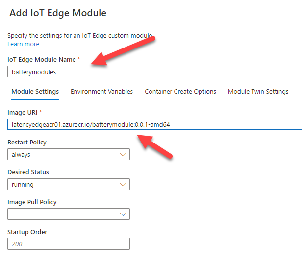
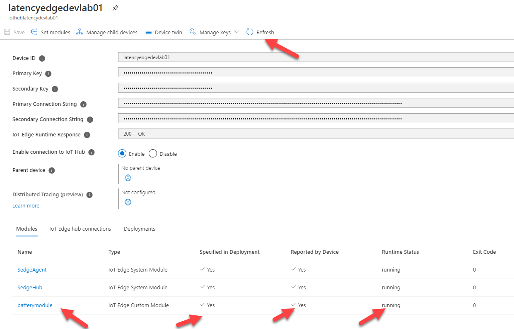
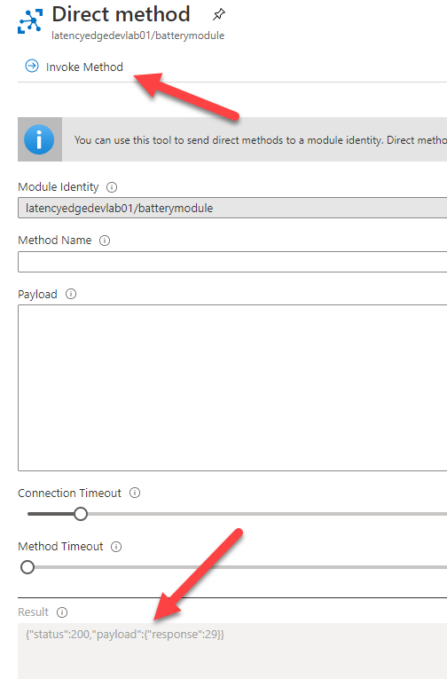

# Custom Module at the Edge
This section demonstrates the process of deploying a custom module to the IoT Edge device and the use of cloud to device telemetry.

## Learning Goals
* Deploy custom module  
* Invoke direct method

## Resources
* [Invoking a direct method](https://docs.microsoft.com/en-us/azure/media-services/live-video-analytics-edge/use-azure-portal-to-invoke-direct-methods)

## Steps
* [Deploy Custom Module](#deploy-custom-module)
* [Invoke direct method](#invoke-direct-method)

### Deploy Custom Module 
A custom module has been published to a private Azure Container Registry (ACR). Navigate to the **module-dev-rg** resource group and click on **latencyedgeacr01** to view the registry's overview pane.
1. The following values are needed from the registry, click on **Access keys** under the **Settings** menu on the left menu
1. Note the value of the following fields:
   - Registry Name
   - Login server
   - Username
   - password
1. The custom module is deployed to the edge device using the associated IoT Hub instance
1. Navigate to the overview pane for your assigned IoT Hub instance, click **IoT Edge** under the **Automatic Device Management** folder section on the left menu
1. A list of IoT Edge devices is shown, click on the device id that corresponds to your assigned IoT Edge Device
1. Click the **Set Modules** link at the top of the page
1. In the **Container Registry Credentials** section fill in the values noted from the Azure Container Registry **Access keys** page
   - Name is set to the Registry Name
   - Address is set to the Login server
   - User Name is set to the Username
   - Password is set to the password
1. Click on the **+ Add** link and then the **+ IoT Edge Module** link
1. Fill out the form as follows:
   - IoT Edge Module Name - **batterymodule**
   - Image uri - **latencyedgeacr01.azurecr.io/batterymodule:0.0.1-amd64**
   
1. Click **Add** button and then **Review + create** button.
1. Review the deployment json. Note the battery module section.
1. Click **Create**. The module deployment process will begin.
1. Deployment of the module can be confirmed by refreshing the details page for the iot edge device
   
1. Via a ssh session to the IoT Edge device view the list of modules, in particular the **batterymodule** module is shown
   ```
   sudo iotedge list
   ```
1. To view the logs for the **batterymodule** run via the ssh session:
   ```
   sudo iotedge logs batterymodule -f
   ```
   This will display log messages as they occur until CTRL + C is pressed

### Invoke direct method
Invoking a direct method refers to the sending of a message from IoT Hub to the module requesting the execution of a defined operation on the module.
1. Visit the details page for the iot edge device. Click on **batterymodule** in the modules list
1. Click the **Direct method** link at the top of the page
1. Fill in the form as follows:
   - Method Name - **get_battery_level**
   - Payload - {}
1. Click the **Invoke Method** link at the top of the page
1. The result of executing the direct method will be shown in the **Result** text box. The logs for the IoT Edge module will also show a method request and response.
   
   